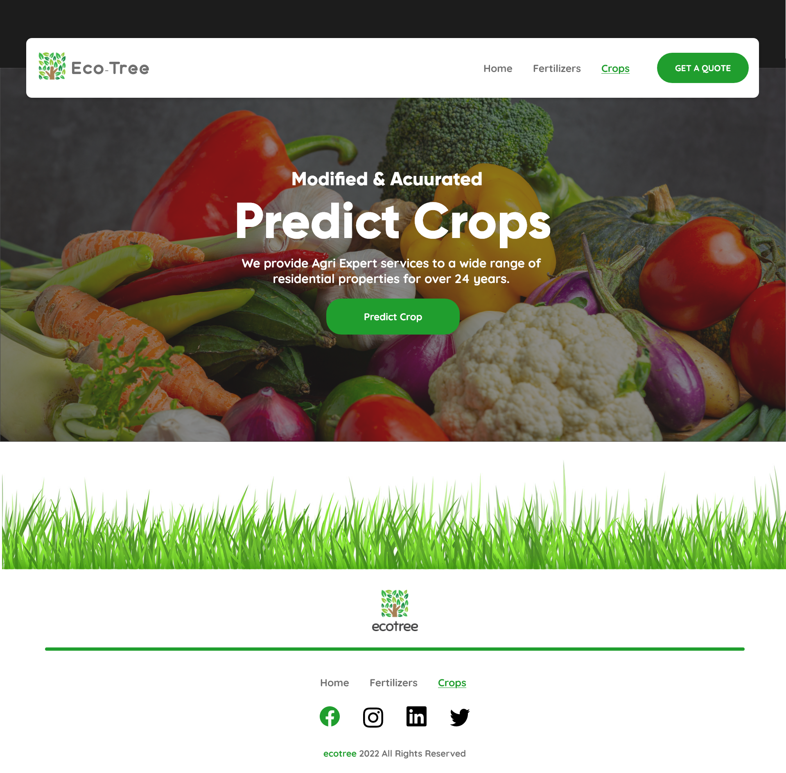

<div align="center">

# eco-tree Web Application

</div>

## About

<b>eco-tree</b> is a machine learning based web application build using Angular and Flask. eco-tree is used for recommending Crop and Fertilizers based on the soil features. The application used three accuractely predciting models to make the final predictions. The link for the python notebooks containing the implementation for the models are present in the <b><a href="#links">All Links</a></b> section of this Readme.<br/>

An API was built using Flask and was deployed on AWS. This Flask API is used to get the recommendation made by the machine learning models in JSON format. The input data is sent as a POST request to the API to get the predicted information.<br/>

Angular was used to build the frontend part of the application. MaterialUI was used for frontend part of the web application.<br/>


<h3><b>Flask API End Points</b></h3>

1. Crop Recommendation End Point: http://ecotreeappfive-env.eba-hphdscvg.ap-south-1.elasticbeanstalk.com/predict_crop
2. Fertilizer Recommendation End Point: http://ecotreeappfive-env.eba-hphdscvg.ap-south-1.elasticbeanstalk.com/predict_fertilizer
   <br/>

<h3><b>About Data returned by Flask API</b></h3>

The data is returned in JSON format:<br/>

1. <b>For Crop Recommendation</b>

```
{
    xgb_model_prediction: "rice",
    xgb_model_probability: 99.2%,
    rf_model_prediction: "rice",
    rf_model_probability: 99.3%,
    knn_model_prediction: "rice",
    knn_model_probability: 99.5%,
    final_prediction: "rice",
}
```

<br/>

2. <b>For Fertilizer Recommendation</b>

```
{
    xgb_model_prediction: "Urea",
    xgb_model_probability: 99.2%,
    rf_model_prediction: "Urea",
    rf_model_probability: 99.3%,
    svm_model_prediction: "Urea",
    svm_model_probability: 99.5%,
    final_prediction: "Urea",
}
```

<br/>
<b>Note:</b> This API can be used in your Web Application or Mobile Application by just sending a POST request with the necessary input data to the above mentioned end points.

## Steps to run the Angular-14 Application in local

1. Clone this repo.
2. Open command prompt in the source folder in frontend
3. Install all the npm packages

```
npm install
```

4. Start the application

```
npm start
```

The Application Runs on localhost:3000

## Steps to run the Flask API in local

1. Clone this repo
2. Open command prompt in "Flask_API"
3. Create a virtual environment

```
mkvirtualenv environment_name
```

4. Install all the packages

```
pip install -r requirements.txt
```

5. Run the app.py file

```
python app.py
```

## <span id="links">All Links</span>

1. <a href="./Notebooks/Crop Recommender/crop-recommendation.ipynb" target="_blank">Crop Recommender Notebook Link</a>
2. <a href="./Notebooks/Fertilizer Recommender/fertilizers-recommendation.ipynb" target="_blank">Fertilizer Recommender Notebook Link</a>
3. <a href="./Notebooks/Crop Recommender/Crop_recommendation.csv" target="_blank">Crop Dataset Link</a>
4. <a href="./Notebooks/Fertilizer Recommender/Fertilizer Prediction.csv" target="_blank">Fertilizer Dataset Link</a>

## Tech Stack Used

<div align="center">

<table>
    <tr>
        <td></td>
    </tr>
    <tr>
        <td></td>
        <td></td>
    </tr>
</table>

</div>

<br/>

## Preview Of Web Application



<div align="center">

Please do ⭐ this repo if you liked my work.

</div>
